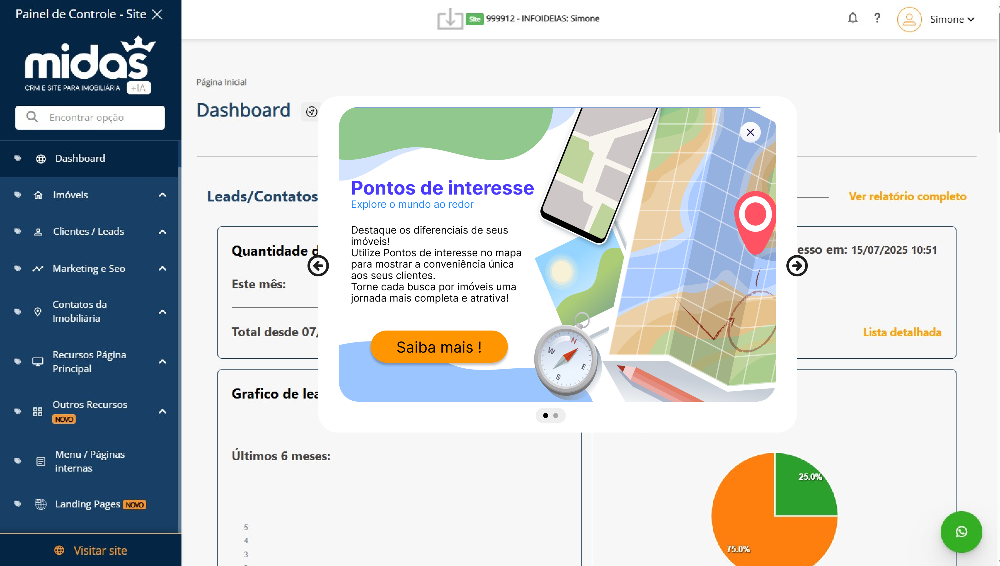
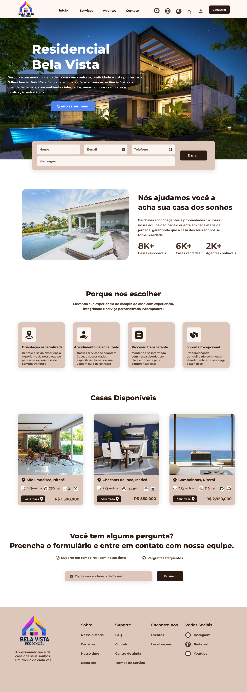

# Análise critica

A proposta original apresenta um pop-up com layout totalmente quadrado, cores vibrantes e um botão de ação com visual datado.

### Pontos positivos:
- Mensagem clara sobre a funcionalidade ("Pontos de interesse").
- Ícones ilustrativos como mapa, celular e bússola que ajudam a contextualizar.

### Oportunidades de melhoria:
- O layout quadrado e o fundo azul degradê passam a sensação de rigidez e desatualização.
- Tipografia sem hierarquia visual suficiente (ex: título em laranja forte, subtítulo em verde claro pouco legível).
- O botão "CLIQUE PARA SABER MAIS" tem:
    1. Bordas arredondadas inconsistentes
    2. Tipografia condensada e pouco moderna
    3. Uso de cor pesada, que remete a interfaces mais antigas
    4. O contraste de cores no botão (laranja/amarelo sobre cinza escuro) não é ideal para acessibilidade.

### Justificativa para redesenho

- Decidimos realizar um redesign completo para alinhar o visual com práticas modernas de UI/UX e tornar a comunicação mais clara, leve e acessível.
    1. Layout arredondado, que passa sensação de leveza e modernidade
    2. Hierarquia visual melhor definida, com título em azul e subtítulo mais legível
    3. Botão com melhor contraste, usando fundo laranja com texto escuro e sombra leve
    4. Uso mais equilibrado do espaço em branco

